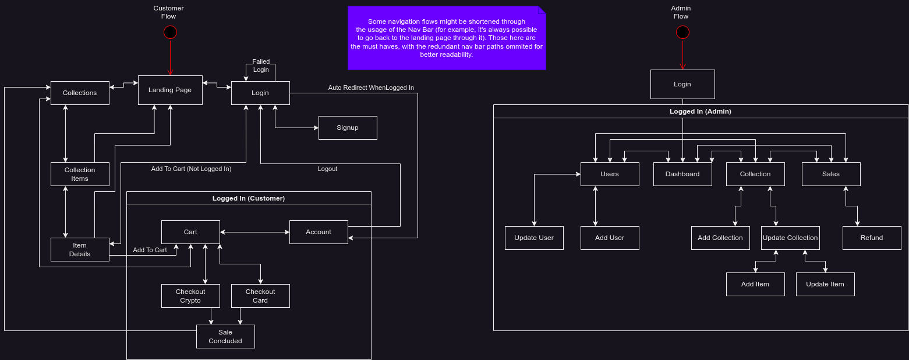

# Project Milestone 1: Store Mockups

**Group 11 - Members:**

- Adalton de Sena Almeida Filho - 12542435
- Daniel Henrique lelis de Almeida - 12543822
- Rafael Zimmer - 12542612

## Project Report - Milestone 1

For this delivery, we've dedicated our focus onto the design and planning of the application. We've also made some HTML & CSS mockups as per the requirements. 

### Description

The idea of the project is to construct a satiric NFT company, which releases various "concept" collections to it's customers, which can then buy the collection items for themselves. Since it doesn't sell physical goods, we decided to ommit fields like `phone` or `address` to keep the project more in-theme. We added some notorious aspects of those marketplaces, like the registering of a crypto address to receive the NFTs and the possibility of "paying with crypto". Even though it's possible, it isn't in our plans to implement real blockchain integrations, so we'll keep everything on that side mocked. 

The core entities which are expected to be persisted on the server are: the users; the collections; the collection items; the user cart (not 100% sure yet, might move it to the client too); and the sales (succeeded or not);

We also have a more complete mockup avaiable on [Figma](https://www.figma.com/file/73WsNtBC5B4Ta5ADKSdRO3/Non-Fazemos-Tamancos?type=design&node-id=0%3A1&t=tQDfAzRGjMiVa548-1).

<iframe style="border: 1px solid rgba(0, 0, 0, 0.1);" width="800" height="450" src="https://www.figma.com/embed?embed_host=share&url=https%3A%2F%2Fwww.figma.com%2Ffile%2F73WsNtBC5B4Ta5ADKSdRO3%2FNon-Fazemos-Tamancos%3Ftype%3Ddesign%26node-id%3D0%253A1%26t%3DtQDfAzRGjMiVa548-1" allowfullscreen></iframe>

And, as we haven't made use of Figma's prototype feature, we also made a navigation diagram:

### Requirements

We've had to change the requirements a little bit from the original one, as our store had some specific needs and incompatibilities with the proposed ones. Here are the reviewed requirements:

- The system must have 2 types of users: Customers and Administrators
  - Administrators are responsible for registering/managing administrators, customers, collections and collections items. They are also responsible for managing and observing sale statistics. During the initial setup a default administator with the user `admin@example.com` and password `admin` will be available.
- The admin and customer records follow the same structure, being differentiated by a `role` variable, their field structure can be described as follows: `id`, `name`, `email`, `password` (hashed), `wallet address` and, finally, the `role` (either `admin` or `customer`).
- The collection records includes: `id`, `name`, `description`, `picture`, `release_date` and `closing_date`. There will also be available some computed information, like total items, items sold and sold value.
- The collection item records include: `id`, `price`, `description`, `sold`, `picture`, `address`.
- Buying items: a logged in customer can add available NFTs to their cart, then once satistfied with their selection, proceed to the checkout phase, where they will be able to choose between paying with crypto, where a payment address will be provided, or paying with a credit card, where they will need to fill their card's information. Once the payment have been completed, the customer will be redirected to the success page and the selected NFTs will become unavailable (in theory, here is where we would send them to the customer's address). 
- Management: administrators will be able to manage the store through a separate page, there, after logged in, they can manage users, creating new ones (including new admins), updating the existing ones, viewing a list of existing users or even delete existing users. The same applies to the collections, but with their specificities of uploading the collecion's picture and managing the release and closing dates. For the collections, the admin will also be able to manage the items of the collection, defining their names, prices and blockchain addresses. The admins will also be able to track the store performance, by looking at the sales and some core viewership metrics. 
- The system must provide accessibility requirements and provide good usability. The system must be responsive, meaning that it should complete assigned tasks within a reasonable time.

### About the code

Currently, for this delivery, focus on the code inside the `prototype/` directory. It's an initial wirefram of the pages' layouts and aesthetic done with basic HTML and CSS. There will be big changes on it as we move on to the more complete implementation for the next milestones.

### Test Plan

For this first milestone, there isn't much to be tested. The overall plan is to go through the core navigation on the nav bar and interact with the components. The pages which should be available now are: the home/landing page; the login page; the storefront page; and the cart page. The navigation between them using the nav bar is what is expected to be working now. Some other aspects like layout integrity and responsiveness should also be tested during the main navigation.

### Test Results

The results are within the expected. All the navigation parts work ok, although there are some small layout tweaks which are needed to best suit the smaller devices. Further down the road we might switch the top nav bar to a hamburger menu for small screen devices.

### Build Procedure

For this delivery, there isn't much into building the application, you can just open the HTML files inside the `prototype/` directory and it should work fine.

### Problems

There are still some missing implementation details for the visual part, but it is expected, as we didn't go too deep into it as most of the code would be disposed during the development of the future milestones.

### Comments

As pointed out earlier, some of the suggested requirements were adjusted to better suit the thematic of the project. In our perspective, the removal of them doesn't impose any change in difficulty or complexity, being mostly related to one field more or less in a form. The *overall* changes and additions should result, even, in a higher complexity for the project.
